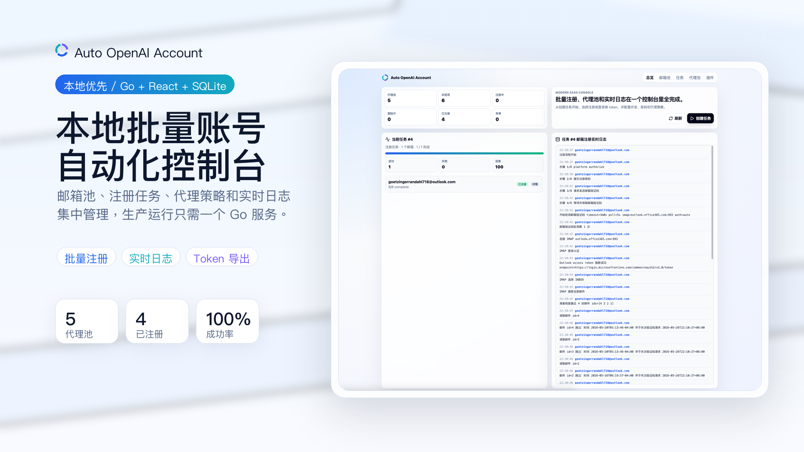
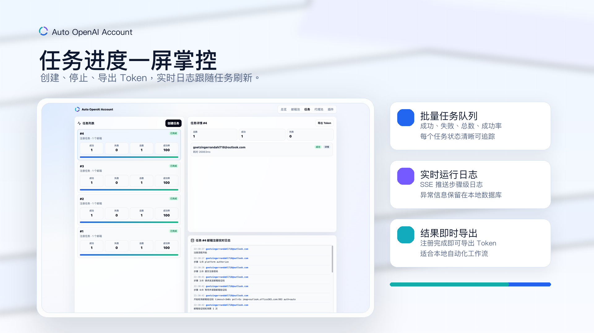
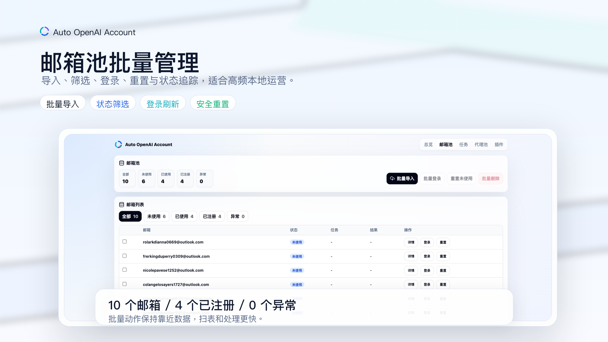

# auto-openai-account

[中文文档](README.md)

Project for automating OpenAi/ChatGpt account registration, login, and token refresh, including mailbox management, proxy configuration, registration/login jobs, runtime logs, and token export.

Main services provided:
- JSON API and Server-Sent Events under `/api/*`
- React single-page app under `/`

## Features

- Mailbox import and management
- System settings management
- Proxy pool configuration and connectivity testing
- OpenAi/ChatGpt account registration job creation, stop, progress, detail, and logs
- Automated login to OpenAi/ChatGpt accounts for token refresh
- Runtime logs written to SQLite and streamed in real-time via SSE
- Token export for completed jobs
- Embedded React UI served directly by Go service

## Screenshots

### Main Dashboard

### Task Management

### Mailbox Management

## Tech Stack
